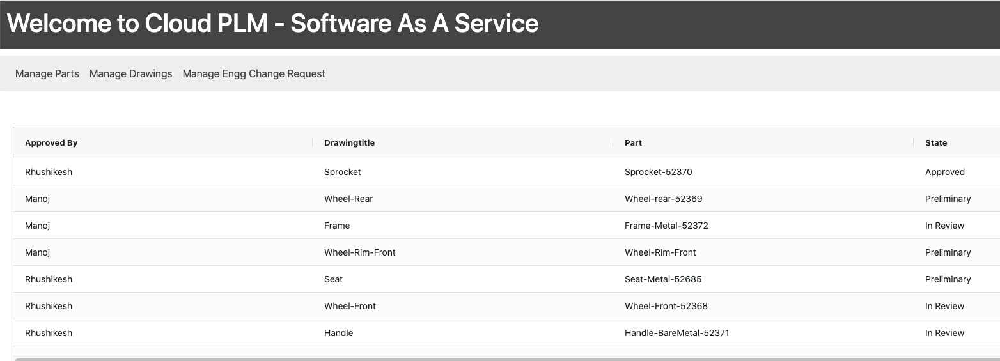

# Cloud Engineering with Pulumi


````
Install pulumi
Install awscurl

Run the following commands

pulumi up

To test the API run the command

awscurl --service execute-api -X POST -d "hello" https://8q3minevj2.execute-api.us-east-1.amazonaws.com/example/proxy


````
# Contribution 1 (Rhushikesh)


# Contribution 2 (Rhushikesh)


# Contribution 3 (Rhushikesh)


# Contribution 4 (Rhushikesh)


# Contribution 5 (Rhushikesh)


# Contribution 1 (Manoj)


# Contribution 2 (Manoj)


# Contribution 3 (Manoj)


# Contribution 4 (Manoj)


# Contribution 5 (Manoj)


# Contribution 6 (Rhushikesh)


